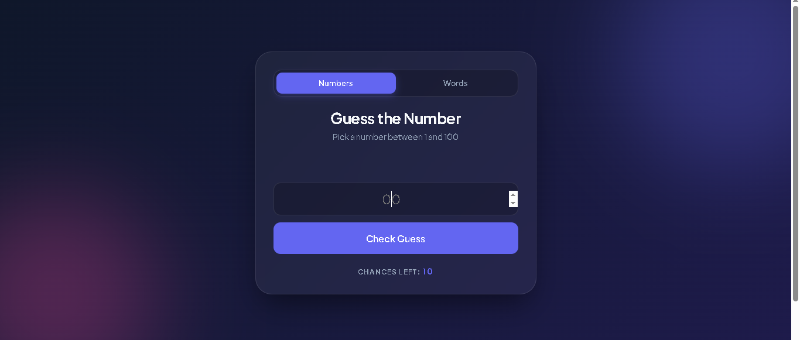
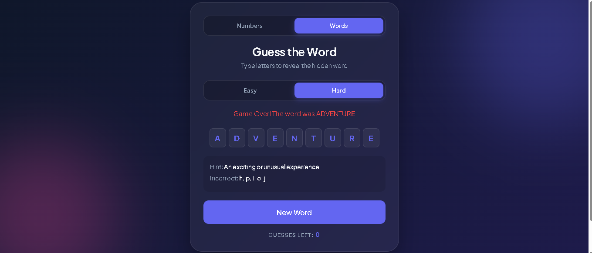

# Guessing Game Hub 🎮

A modern guessing game web application built with **HTML, CSS, and JavaScript**. It features two interactive game modes: a number guessing game and a word guessing game (hangman-style).

## 🚀 Features

* **Two Game Modes:** Switch between Number Guessing and Word Guessing instantly  
* **Dynamic UI:** No page reloads — smooth transitions using JavaScript  
* **Number Game:** Guess a number between 1–100 with hints (Too High / Too Low)  
* **Word Game:** Hangman-style gameplay with difficulty levels  
  - Easy Mode (more chances)  
  - Hard Mode (fewer chances)  
* **Keyboard Interaction:** Type letters directly for gameplay  
* **Game State Management:** Handles wins, losses, and resets  
* **Responsive Design:** Works on both mobile and desktop  

---

## 📸 Screenshots






---

## 🛠️ Tech Stack

* HTML5  
* CSS3 (Glassmorphism UI)  
* JavaScript (Game Logic)  

---

## ▶️ How to Run

1. Download or clone the repository:
```bash
git clone https://github.com/T-I-W-O/guessing-game-hub.git
2.Open the project folder
3.Open index.html in your browser

## 📌 Status
Simple frontend project demonstrating JavaScript logic and UI interaction

## 🚀 Future Improvements
Add sound effects
Add score tracking
Add more word categories
Improve animations
